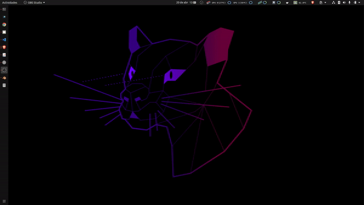

# RAM monitor

🖥️ RAM Monitor for Ubuntu: real-time RAM tracking in your menu bar. Live free/used/cached/swap stats and the top processes by RSS, all from a tiny system-tray icon.



## Architecture

Two flavours, same project:

- **Rust (current)** — workspace with three crates:
  - `ram-monitord` — HTTP+SSE daemon that reads `/proc/meminfo` and `/proc/<pid>/status` (~few MB RSS, < 1% CPU).
  - `ram-monitor-tray` — Linux system-tray frontend. Renders the icon with `tiny-skia` + FreeType.
  - `ram-monitor-core` — shared serde types between back and front.
- **Python (legacy)** — `legacy/ram_monitor.py`, a single-file GTK indicator. Still functional, kept for reference for one release cycle.

A native macOS frontend lives in `front-mac/` as an independent Swift Package (Swift + AppKit + CoreGraphics, zero third-party deps). It consumes the same `/v1/stream` endpoint and renders into the macOS menubar via `NSStatusItem`. See [`front-mac/README.md`](front-mac/README.md).

The two can coexist on different ports. Splitting the daemon from the UI lets another machine on the LAN consume the same metrics — the Mac frontend connects directly when the daemon binds LAN, or through SSH port forwarding while the daemon stays on `127.0.0.1`.

Sister projects (each one is its own repo so you can install only what your machine needs): [`gpu_monitor`](https://github.com/maximofn/gpu_monitor), `cpu_monitor`, `disk_monitor`. Default ports: gpu=9123, cpu=9124, **ram=9125**, disk=9126.

## Install (Rust)

### Build

```bash
sudo apt install fonts-dejavu-core libfreetype6 libfreetype-dev pkg-config build-essential
git clone https://github.com/maximofn/ram_monitor.git
cd ram_monitor
cargo build --release --workspace
```

### Install binaries and assets

```bash
install -m 0755 target/release/ram-monitord     ~/.local/bin/
install -m 0755 target/release/ram-monitor-tray ~/.local/bin/
install -Dm 0644 assets/ram.png                 ~/.local/share/ram-monitor/ram.png
```

### Daemon as a user systemd service

```bash
install -Dm 0644 packaging/systemd/ram-monitord.service ~/.config/systemd/user/ram-monitord.service
systemctl --user daemon-reload
systemctl --user enable --now ram-monitord
```

Sanity check:

```bash
curl -s http://127.0.0.1:9125/v1/info
curl -s http://127.0.0.1:9125/v1/memory
```

### Tray as autostart

```bash
install -Dm 0644 packaging/autostart/ram-monitor-tray.desktop ~/.config/autostart/ram-monitor-tray.desktop
nohup ~/.local/bin/ram-monitor-tray >/dev/null 2>&1 & disown
```

Or just log out / log in.

### CLI flags

```bash
ram-monitord --help
# --bind, --port, --sample-interval-ms, --max-processes, --mock, --log-level

ram-monitor-tray --help
# --backend-url, --icon-height, --dump-icon (debug: render one PNG and exit), --log-level
```

## Install (Python, legacy)

> Kept for one release cycle. Prefer the Rust path above. The `legacy/` directory will be removed once the Rust path proves stable in the wild.

```bash
sudo apt install lm-sensors psensor python3-pip
sudo sensors-detect
pip3 install psutil matplotlib
cd legacy && ./add_to_startup.sh
```

## API (HTTP)

The daemon serves snapshots over plain HTTP and SSE.

| Method | Path             | Description                                |
|--------|------------------|--------------------------------------------|
| GET    | `/healthz`       | Liveness + uptime                          |
| GET    | `/v1/info`       | Backend version, host, kernel, total RAM   |
| GET    | `/v1/snapshot`   | Full snapshot (memory + swap + processes)  |
| GET    | `/v1/memory`     | Memory totals only                         |
| GET    | `/v1/swap`       | Swap totals only                           |
| GET    | `/v1/processes`  | Top-N processes by RSS                     |
| GET    | `/v1/stream`     | SSE stream of `Snapshot` events            |

Defaults: bind `127.0.0.1`, port `9125`, sample interval 1 s, top-20 processes.

## macOS frontend

```bash
cd front-mac
./scripts/build-app.sh
open "build/RAM Monitor.app" --args --backend-url http://127.0.0.1:9125
```

The daemon defaults to binding `127.0.0.1` (no auth). To consume metrics from a remote Linux box without exposing the API on the LAN, forward the port over SSH:

```bash
ssh -fN -L 9125:127.0.0.1:9125 <ubuntu-host>
open "build/RAM Monitor.app" --args --backend-url http://127.0.0.1:9125
```

Requires macOS 13 or later. The app is menubar-only (`LSUIElement=true`): no Dock icon, no window. Click the icon for a submenu with RAM, swap, and top-process detail — the same data the Linux tray exposes.

To auto-start the tray on login, install the bundled LaunchAgent:

```bash
cd front-mac
./scripts/install-launchagent.sh             # install + load now
./scripts/install-launchagent.sh uninstall   # remove
```

For a persistent SSH tunnel that survives reboots and SSH drops, install the tunnel LaunchAgent (edit the host in the plist first if it isn't `wallabot`):

```bash
./scripts/install-tunnel.sh                  # install + load now
./scripts/install-tunnel.sh uninstall        # remove
```

Logs land in `~/Library/Logs/ram-monitor-tray.{out,err}.log` and `~/Library/Logs/ram-monitor-tunnel.{out,err}.log`. The tray agent expects the backend reachable at `http://127.0.0.1:9125`.

## Home Assistant integration

Surface RAM state as native HA sensors with no custom component — just a YAML package on top of `default_config`'s `rest` integration. Polls `/v1/snapshot` every 15 s and exposes 15 entities (host metadata + total/used/available/free/buffers/cached in GiB, used %, swap total/used/% and top process with full process list as attribute).

```bash
# On the raspberry running Home Assistant:
cd home-assistant/tunnel
./install.sh                                 # generates dedicated SSH key, installs systemd user unit
# (paste the printed pubkey line into the RAM host's ~/.ssh/authorized_keys)

# Copy the package and reload HA:
cp ../packages/ram_monitor.yaml /config/packages/
# Add to /config/configuration.yaml (one-time per HA install):
#   homeassistant:
#     packages: !include_dir_named packages
docker restart homeassistant
```

The dedicated key is restricted with `restrict,port-forwarding,permitopen="127.0.0.1:9125"` so it can only forward to `ram-monitord` and nothing else. Coexists in `/config/packages/` with packages from sibling monitors. See [`home-assistant/README.md`](home-assistant/README.md) for the full deploy guide and Lovelace dashboard.

## Support

Consider giving a **☆ Star** to this repository, or invite me to a coffee:

[](https://www.buymeacoffee.com/maximofn)
